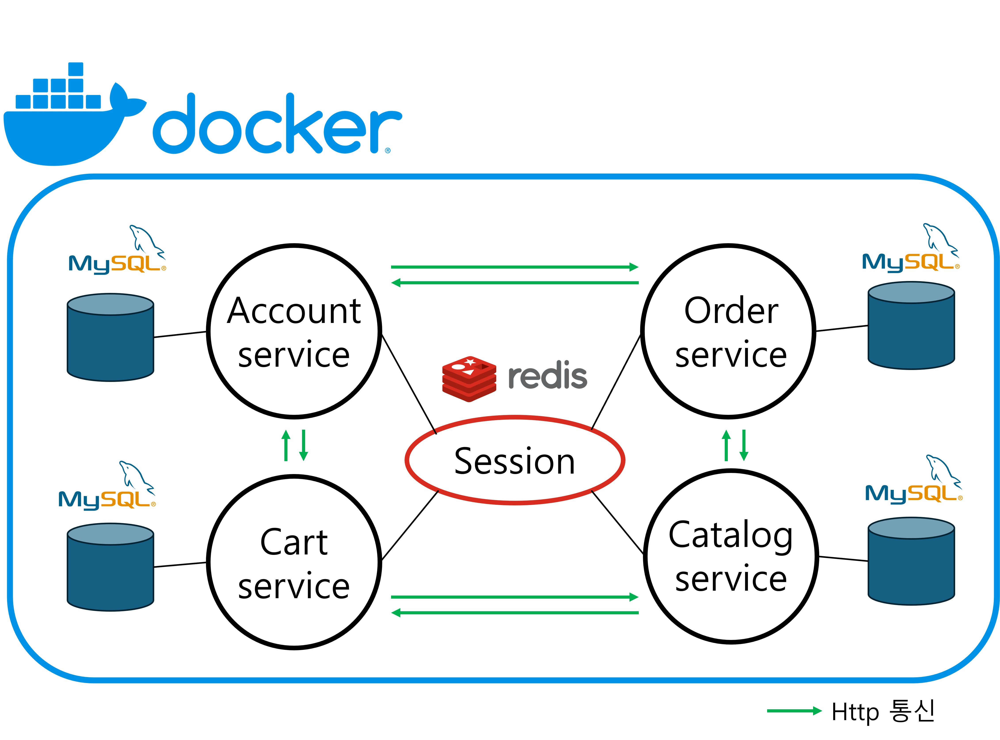

# Microservices version of JPetStore6

## Abstract of architecture

## To do...
### Common Changes
- [ ] Replace stripes with standard controller
- [ ] Remove stripes tags from JSP
- [ ] Apply redis for session clustering

### 앞으로 구현해야 할 것들
- [ ] Gateway를 추가하고, 인증 관리 및 라우팅을 담당하도록 한다. 모든 컨트롤러에서 인증을 확인하는 If문이 제거될 수 있다.
- [ ] 어드민 기능을 추가한다. 현재 상품의 경우 조회만 가능한데, 상품의 CUD를 어드민이 담당하도록 구현한다.
- [ ] 각 서비스 내에서 데이터베이스에 락이 필요한 경우 구현한다.
- [ ] 서비스가 분리되면서 ACID 트랜잭션이 보장되지 않는다. 따라서 분산 트랜잭션을 고려할 필요가 있다. 보상 트랜잭션을 통해 롤백을 수행한다.
- [ ] 마이크로서비스 아키텍처의 핵심은 캐시이다. 상품 조회와 같이 잘 변하지 않는 것들은 로컬 캐시로 설정해 매번 조회 쿼리가 수행되지 않도록 한다.

### 앞으로 고민해야 할 것들
- [ ] 서비스 간의 세션 공유가 적절한가? 단일 장애 지점이 되지는 않는가?
- [ ] 다른 서비스의 로직을 참고하는 상황에서 N+1 문제가 발생하지는 않는가? API 통신이기 때문에 호출량이 많아지면 엄청난 지연이 발생 가능하다.
- [ ] 현재와 같이 SSR일 경우에 다른 서비스의 데이터들을 조합까지 한 후 뷰를 반환하게 되면 응답 속도가 SPA에 비해 느려지지 않는가? 그렇다면 뷰를 분리할 것인가?
